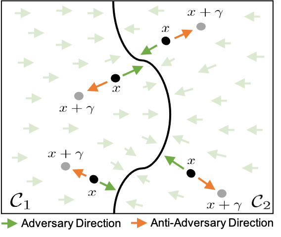

# Combating-Adversaries-with-Anti-Adversaries

This is the official repor for the work: "Combating Adversaries with Anti-Adversaries"

This work is accepted to AAAI Conference on Artificial Intelligence (AAAI'22).

preprint: https://arxiv.org/pdf/2103.14347.pdf



## Environment Installations:
First, you need to install the environment from the provided yml file by running:

`conda env create -f anti_adv.yml`

Then, activate the envionment by running:

`conda activate anti_adv`

## Reproducing our Results:
To reproduce the results against AutoAttack (APGD, ADLR, FAB and Square attacks) for AWP and AWP+Anti-Adv, you need to download the weights of AWP model for CIFAR 10 from their official repo. Then, go to `adv_weight_pert.py` and change the `WEIGHTS_PATH` argument to the path were you saved the weights in.

Then, run the following command for AWP+Anti-Adv.

` python main.py --checkpoint runs --experiment awp --k 2 --alpha 0.15`

and run the following for AWP.

` python main.py --checkpoint runs --experiment awp --k 0 --alpha 0.0`

For other baselines, copy their model defintion in the experiments directory in a similar fashion to `adv_weight_pert.py`, and import their `get_model` function in `utils.py` line 166. Finally, add the experiment name to the `opts.py` in the `EXP_CHOICES` argument.

## Wanna Use the Anti-Adversary Layer with Your Classifier ?
Simply use the wrapper in `Anti_Adv.py`. The wrapper takes the following arguments:

`model`: a PyTorch trained model

`mean`: a list or a numpy arry containing the mean used to normalize the data. 

`std`: a list or a numpy arry containing the standard deviation used to normalize the data.

`k`: a scalar representing the number of iterations used to compte the anti-adversary.

`alpha:` a scalar representing the learning rate used to compute the anti-adversary.

## Citation

If you find our work useful, please consider citing it as
```bash
@misc{alfarra2021combating,
      title={Combating Adversaries with Anti-Adversaries}, 
      author={Motasem Alfarra and Juan C. Pérez and Ali Thabet and Adel Bibi and Philip H. S. Torr and Bernard Ghanem},
      year={2021},
      eprint={2103.14347},
      archivePrefix={arXiv},
      primaryClass={cs.LG}
}
```
This project is licensed under the terms of the MIT license.
